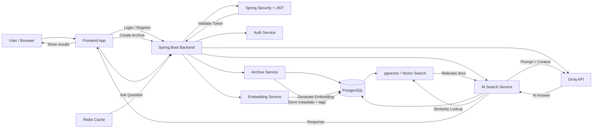

# secondBrain

<p align="center">
  
</p>

secondBrain is an AI-powered personal knowledge and archive system that helps users save web resources, tag them, and later search them using semantic similarity instead of plain keyword matching.

## System Architecture



## Overview

This project is a Java Spring Boot backend designed to act like a personal second brain:

- Save bookmarks, links, and notes
- Store metadata and tags for each archive item
- Generate embeddings for content
- Perform vector similarity search for smarter retrieval
- Ask AI questions using the saved knowledge base
- Secure access with JWT authentication

## Key Features

- User registration and login
- JWT-based authentication and authorization
- Archive creation, update, deletion, and listing
- Tag support for categorizing resources
- Semantic search powered by embeddings and pgvector
- AI-assisted Q&A over saved archives using Groq
- Async processing for background tasks
- Redis cache support (optional)
- REST API design for frontend integration

## Tech Stack

- Java 21
- Spring Boot 4.0.6
- Spring Web MVC
- Spring Data JPA
- PostgreSQL
- pgvector / Hibernate Vector support
- Spring Security
- JWT (jjwt)
- Redis
- Lombok
- Maven
- Groq API

## Project Structure

```text
secondBrain/
├── src/
│   ├── main/
│   │   ├── java/
│   │   │   └── com/project/secondBrain/
│   │   │       ├── config/
│   │   │       ├── controller/
│   │   │       ├── dto/
│   │   │       ├── entity/
│   │   │       ├── exception/
│   │   │       ├── repository/
│   │   │       ├── security/
│   │   │       └── service/
│   │   └── resources/
│   │       └── application.properties
│   └── test/
├── pom.xml
├── dockerfile-sb.docker
├── mvnw
├── mvnw.cmd
├── README.md
└── assets/
    └── secondbrain-banner.svg
```

## Application Flow

1. User registers or logs in.
2. User creates an archive item with title, description, URL, and tags.
3. The backend generates an embedding for the archive content.
4. The vector is stored in PostgreSQL using pgvector.
5. When the user asks a question, the app generates a query embedding and performs similarity search.
6. Relevant archives are retrieved and used to build an AI response.

## API Highlights

### Authentication

- POST `/api/auth/register`
- POST `/api/auth/login`

### Archives

- POST `/api/archives`
- GET `/api/archives`
- GET `/api/archives/{id}`
- PUT `/api/archives/{id}`
- DELETE `/api/archives/{id}`
- GET `/api/archives/search`

### AI Search

- POST `/api/ai/search`

## Configuration

The application configuration is in `src/main/resources/application.properties`.

Important settings include:

- PostgreSQL datasource URL and credentials
- JWT secret key
- JPA auto-update configuration
- Groq API key
- Redis cache settings

## Local Setup

### Prerequisites

- Java 21
- Maven
- PostgreSQL running locally
- Redis (optional for cache features)
- Groq API key

### Run the project

```bash
./mvnw spring-boot:run
```

or on Windows:

```powershell
mvnw.cmd spring-boot:run
```

## Notes

This project is a backend-first implementation and is designed to work with a frontend app that sends requests to the REST APIs.

## License

This project is currently unlicensed and intended for learning and personal project use unless you add a license explicitly.

---

Built with Java, Spring Boot, PostgreSQL, pgvector, and AI-powered retrieval.
